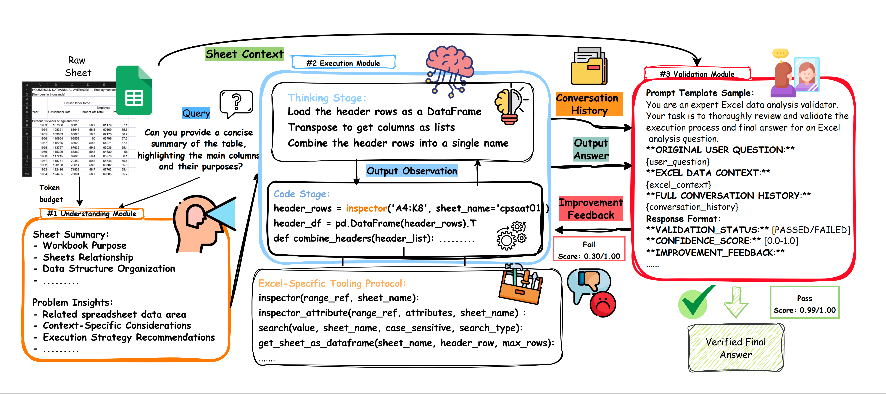

# SheetBrain 🧠

**SheetBrain** is an intelligent Excel analysis and automation toolkit powered by LLM agent. It provides a three-stage architecture (Understand-Execute-Validate) for comprehensive Excel data analysis with iterative improvement capabilities. This repository provides the implementation of the methods described in our paper.

## Features

- 🔍 **Understanding Module**: Analyzes Excel structure and context using multimodal LLM
- 💻 **Execution Module**: Multi-turn reasoning and Python code execution for complex analysis
- ✅ **Validation Module**: Quality assurance and iterative improvement through LLM validation
- 📊 **Excel Toolkit**: Comprehensive utilities for Excel operations (reading, writing, formatting, charts)
- 🔄 **Iterative Improvement**: Automatic refinement of analysis through validation feedback
- 🛠️ **Flexible Configuration**: Customizable settings and deployment options

## Architecture

```
┌─────────────────┐    ┌─────────────────┐    ┌─────────────────┐
│  Understanding  │ -> │   Execution     │ -> │   Validation    │
│     Module      │    │     Module      │    │     Module      │
└─────────────────┘    └─────────────────┘    └─────────────────┘
        │                       │                       │
        v                       v                       v
   Analyze Excel          Multi-turn Code        Quality Assurance
   Structure & Context    Execution & Logic      & Feedback Loop
```

## Installation

### Prerequisites

- Python 3.8 or higher
- OpenAI API access

### Install from Source

```bash
git clone https://github.com/microsoft/SheetBrain.git
cd SheetBrain
pip install -r requirements.txt
```

## Quick Start

### 1. Basic Usage

```python
# Import from the organized modules
from core.agent import SheetBrain

# Initialize SheetBrain
agent = SheetBrain(excel_path="your_file.xlsx")

# Ask a question about your Excel file
result = agent.run(
    user_question="What is the total sales for Q4?",
    max_turns=3,
    enable_validation=True,
    enable_understanding=True
)

print(f"Answer: {result['answer']}")
print(f"Confidence: {result['confidence_score']:.2f}")
```

### 2. Using Configuration

```python
from core.agent import SheetBrain
from config.settings import Config

# Custom configuration
config = Config(
    api_key="your-openai-api-key",
    base_url="https://api.openai.com/v1",
    deployment="gpt-4",
    max_turns=5,
    enable_validation=True,
    enable_understanding=True
)

agent = SheetBrain(excel_path="your_file.xlsx", config=config)
result = agent.run("Find the top 5 customers by revenue")
```

### 3. Command Line Interface

```bash
# Basic usage via Python module
python -m main your_file.xlsx "What is the average sales per month?"

# Or run directly
python main.py your_file.xlsx "Analyze quarterly trends" \
    --max-turns 5 \
    --token-budget 15000 \
    --verbose

# Disable certain stages
python main.py your_file.xlsx "Simple question" \
    --no-validation \
    --no-understanding
```

## Running Examples

SheetBrain includes built-in example to help you get started:

```bash
# Run the included example script
python run_example.py
```


## Advanced Usage

### Working with Images

```python
from PIL import Image

# Load a screenshot of your Excel sheet
image = Image.open("excel_screenshot.png")

result = agent.run(
    user_question="Analyze the chart in this image",
    table_image=image
)
```

### Iterative Analysis

```python
# The agent automatically iterates when validation fails
result = agent.run(
    user_question="Complex analysis requiring multiple steps",
    max_turns=10,  # Allow more iterations for complex tasks
    enable_validation=True  # Enable automatic improvement
)

# Check iteration details
print(f"Total iterations: {result['total_iterations']}")
for i, exec_result in enumerate(result['all_execution_results']):
    print(f"Iteration {i+1}: {exec_result['success']}")
```

## API Reference

### SheetBrain Class

```python
from core.agent import SheetBrain
from config.settings import Config

class SheetBrain:
    def __init__(
        self,
        excel_path: str,
        config: Optional[Config] = None,
        total_token_budget: int = 10000,
        load_excel: bool = True,
        excel_context_understanding: Optional[str] = None,
        excel_context_execution: Optional[str] = None
    )

    def run(
        self,
        user_question: str,
        table_image: Optional[Image.Image] = None,
        max_turns: Optional[int] = None,
        enable_validation: Optional[bool] = None,
        enable_understanding: Optional[bool] = None
    ) -> Dict[str, Any]
```

## Error Handling

SheetBrain includes comprehensive error handling:

```python
from core.agent import SheetBrain

try:
    agent = SheetBrain("your_file.xlsx")
    result = agent.run("Your question here")
    if not result['success']:
        print(f"Analysis failed: {result['answer']}")
        print(f"Issues found: {result['issues_found']}")
except Exception as e:
    print(f"Critical error: {e}")
```

## File Structure

```
SheetBrain/
├── config/                     # Configuration management
│   ├── __init__.py
│   └── settings.py            # Config class with environment support
├── core/                      # Core functionality
│   ├── __init__.py
│   └── agent.py              # Main SheetBrain agent class
├── modules/                   # Processing modules
│   ├── __init__.py
│   ├── understanding.py      # Understanding module
│   ├── execution.py          # Execution module
│   └── validation.py         # Validation module
├── utils/                     # Utilities
│   ├── __init__.py
│   ├── excel_toolkit.py      # Excel operations toolkit
│   └── logger.py             # Logging utilities
├── main.py                    # CLI entry point
├── run_example.py            # Standalone example runner
├── setup.py                  # Package setup
├── requirements.txt          # Dependencies
└── README.md                 # This file
```

## Performance Tips

1. **Token Budget Management**: Adjust `total_token_budget` based on file size
2. **Disable Stages**: Use `enable_validation=False` for simple queries
3. **Iteration Control**: Set appropriate `max_turns` for task complexity

## Troubleshooting

### Common Issues

1. **API Key Not Set**: Ensure `OPENAI_API_KEY` environment variable is set
2. **File Not Found**: Check Excel file path is correct and accessible
3. **Memory Issues**: limit `total_token_budget` for very large files

### Debug Mode

```python
import logging
logging.basicConfig(level=logging.DEBUG)

# Enable verbose output
result = agent.run(user_question, verbose=True)
```
## Citation
If you find our work helpful, please use the following citations.


## Contributing

This project welcomes contributions and suggestions. Most contributions require you to
agree to a Contributor License Agreement (CLA) declaring that you have the right to,
and actually do, grant us the rights to use your contribution. For details, visit
https://cla.microsoft.com.

When you submit a pull request, a CLA-bot will automatically determine whether you need
to provide a CLA and decorate the PR appropriately (e.g., label, comment). Simply follow the
instructions provided by the bot. You will only need to do this once across all repositories using our CLA.

This project has adopted the [Microsoft Open Source Code of Conduct](https://opensource.microsoft.com/codeofconduct/).
For more information see the [Code of Conduct FAQ](https://opensource.microsoft.com/codeofconduct/faq/)
or contact [opencode@microsoft.com](mailto:opencode@microsoft.com) with any additional questions or comments.

## Trademarks

This project may contain trademarks or logos for projects, products, or services. Authorized use of Microsoft 
trademarks or logos is subject to and must follow 
[Microsoft's Trademark & Brand Guidelines](https://www.microsoft.com/en-us/legal/intellectualproperty/trademarks/usage/general).
Use of Microsoft trademarks or logos in modified versions of this project must not cause confusion or imply Microsoft sponsorship.
Any use of third-party trademarks or logos are subject to those third-party's policies.